# Architecture

## Overview

The **pratica** stack runs each service in its own Docker container orchestrated by **Docker Compose**. ChromaDB runs as a dedicated HTTP server container; the API connects to it via `HttpClient`.

```mermaid
graph TD
    U(["👤 User / Browser"])

    subgraph Compose["🐳 Docker Compose Network"]
        direction TB

        ST["🖥️ streamlit\n:8501"]
        API["⚡ api (FastAPI)\n:8000"]
        PX["🔭 phoenix\n:6006"]
        MK["📚 mkdocs\n:8080"]
        DB[("🗄️ chromadb\n:8000 (internal)\n:8001 (host)")]

        subgraph RAG["LangChain RAG Pipeline (inside api)"]
            LD["📄 Document Loader\nPyPDF / TextLoader"]
            SP["✂️ Text Splitter\nRecursiveCharacter"]
            EM["🔢 OpenAI Embeddings\ntext-embedding-ada-002"]
        end
    end

    OAI(["☁️ OpenAI API"])

    U -->|":8501"| ST
    U -->|":8000"| API
    U -->|":6006"| PX
    U -->|":8080"| MK
    ST -->|"REST + JWT"| API
    API --> LD --> SP --> EM
    EM <-->|"embeddings"| OAI
    EM -->|"HttpClient :8000"| DB
    DB -->|"similarity search"| API
    API <-->|"chat completion"| OAI
    API -->|"OTLP traces"| PX
```

> `chromadb` is exposed on host port **8001** to avoid conflict with the API on **8000**.

---

## Tech Stack

| Layer | Technology |
|-------|-----------|
| API framework | FastAPI + Uvicorn |
| Authentication | OAuth2 Password Flow + JWT (`python-jose`) |
| Password hashing | `passlib` sha256_crypt |
| Document loading | LangChain `PyPDFLoader`, `TextLoader` |
| Text splitting | `RecursiveCharacterTextSplitter` (1 000 chars, 150 overlap) |
| Embeddings | OpenAI `text-embedding-ada-002` |
| Vector store | ChromaDB (dedicated container, `HttpClient`) |
| LLM | OpenAI `gpt-4o-mini` (Gemini fallback) |
| UI | Streamlit |
| Tracing | Arize Phoenix + OpenTelemetry |
| Runtime | Python 3.13, uv |
| Containerization | Docker + Docker Compose |
| Docs | MkDocs Material |

---

## Data Flow

### Upload flow

### Query flow

---

## Volume Layout

```mermaid
graph LR
    V1[("📦 rag_data")]      --> U["/app/uploads\nraw uploaded files"]
    V2[("📦 chromadb_data")] --> C["/chroma/chroma\nChromaDB collection"]
    V3[("📦 phoenix_data")]  --> P["/mnt/data\nPhoenix traces"]
```

