# Getting Started

## Prerequisites

| Requirement | Version |
|-------------|---------|
| Docker | 24+ |
| Docker Compose | v2 (bundled with Docker Desktop) |
| OpenAI API key | — |

---

## Startup Flow

```mermaid
flowchart LR
    A(["📝 Create .env\nOPENAI_API_KEY=sk-..."])
    B["🔨 docker compose\nup --build -d"]
    C{"Health checks\npassing?"}
    D(["✅ All services\nready"])

    A --> B --> C -->|"yes (~15 s)"| D
    C -->|"no"| C
```



---

## 1. Clone and configure

```bash
git clone <repo-url>
cd <project-folder>
```

Create a `.env` file in the project root:

```bash
# required
OPENAI_API_KEY=sk-...

# optional — enables Gemini fallback if OpenAI fails
GOOGLE_API_KEY=AIza...
```

## 2. Start all services

```bash
docker compose up --build -d
```

This brings up five containers:

| Container | Role |
|-----------|------|
| `phoenix` | Arize Phoenix tracing UI |
| `chromadb` | ChromaDB vector store |
| `api` | FastAPI backend |
| `streamlit` | Browser UI |
| `mkdocs` | This documentation site |

Wait for all health checks to pass (about 15–20 seconds):

```bash
docker compose ps
```

## 3. Open the services

| Service | URL |
|---------|-----|
| Streamlit UI | [http://localhost:8501](http://localhost:8501) |
| FastAPI Swagger | [http://localhost:8000/docs](http://localhost:8000/docs) |
| Arize Phoenix tracing | [http://localhost:6006](http://localhost:6006) |
| ChromaDB API | [http://localhost:8001](http://localhost:8001) |
| MkDocs (this site) | [http://localhost:8080](http://localhost:8080) |

## 4. Default credentials

| Field | Default value |
|-------|---------------|
| Username | `admin` |
| Password | `changeme` |

!!! danger "Change before sharing"
    Set `APP_USER=youruser:strongpassword` and `SECRET_KEY=<random-64-char-string>` in your environment or `.env` before any shared deployment.

## 5. Quick test with cURL

```bash
# 1. Obtain a token
TOKEN=$(curl -s -X POST http://localhost:8000/auth/login \
  -d "username=admin&password=changeme" | jq -r .access_token)

# 2. Upload a document
curl -s -X POST http://localhost:8000/documents \
  -H "Authorization: Bearer $TOKEN" \
  -F "files=@/path/to/document.pdf"

# 3. Ask a question
curl -s -X POST http://localhost:8000/rag/query \
  -H "Authorization: Bearer $TOKEN" \
  -H "Content-Type: application/json" \
  -d '{"question": "What is this document about?"}'
# Response includes "provider": "openai" or "provider": "gemini"
```

## 6. Stop and clean up

```bash
# Stop all containers
docker compose down

# Remove volumes too (destructive — deletes all indexed documents)
docker compose down -v
```
