# Architecture

## Overview

The **monolith** variant runs all services inside a single Docker container managed by **supervisord**. ChromaDB operates as an embedded `PersistentClient` — no separate network service is needed.

```mermaid
graph TD
    U(["👤 User / Browser"])

    subgraph Container["🐳 Docker Container"]
        direction TB
        SV["⚙️ supervisord\nprocess manager"]

        subgraph Services["Services"]
            ST["🖥️ Streamlit UI\n:8501"]
            API["⚡ FastAPI\n:8000"]
            PX["🔭 Arize Phoenix\n:6006"]
            MK["📚 MkDocs\n:8080"]
        end

        subgraph RAG["LangChain RAG Pipeline"]
            LD["📄 Document Loader\nPyPDF / TextLoader"]
            SP["✂️ Text Splitter\nRecursiveCharacter"]
            EM["🔢 OpenAI Embeddings\ntext-embedding-ada-002"]
            DB[("🗄️ ChromaDB\nPersistentClient\n/data/chromadb")]
        end

        SV --> Services
        API --> LD --> SP --> EM --> DB
    end

    OAI(["☁️ OpenAI API"])

    U -->|":8501"| ST
    U -->|":8000"| API
    U -->|":6006"| PX
    U -->|":8080"| MK
    ST -->|"REST + JWT"| API
    EM <-->|"embeddings"| OAI
    API <-->|"chat completion"| OAI
    API -->|"OTLP traces"| PX
```

> All four ports (`8000`, `6006`, `8501`, `8080`) are exposed from the same container.
> Data is persisted in the `/data` volume: uploads, ChromaDB collections, and Phoenix traces.

---

## Tech Stack

| Layer | Technology |
|-------|-----------|
| API framework | FastAPI + Uvicorn |
| Authentication | OAuth2 Password Flow + JWT (`python-jose`) |
| Password hashing | `passlib` bcrypt |
| Document loading | LangChain `PyPDFLoader`, `TextLoader` |
| Text splitting | `RecursiveCharacterTextSplitter` (1 000 chars, 150 overlap) |
| Embeddings | OpenAI `text-embedding-ada-002` |
| Vector store | ChromaDB (`PersistentClient`, embedded) |
| LLM | OpenAI `gpt-4o-mini` |
| UI | Streamlit |
| Tracing | Arize Phoenix + OpenTelemetry |
| Process manager | supervisord |
| Runtime | Python 3.13 |
| Containerization | Docker (single image) |
| Docs | MkDocs Material |

---

## Data Flow

### Upload flow

### Query flow

---

## Volume Layout

```mermaid
graph LR
    V[("📦 doc_qa_data\nDocker volume")]
    V --> U["/data/uploads\nraw uploaded files"]
    V --> C["/data/chromadb\nChromaDB collection"]
    V --> P["/data/phoenix\nPhoenix traces"]
```

