# Getting Started

## Prerequisites

| Requirement | Version |
|-------------|---------|
| Docker | 24+ |
| OpenAI API key | — |

---

## Startup Flow

```mermaid
flowchart LR
    A(["🔑 Export\nOPENAI_API_KEY"])
    B["🔨 docker build\n-t doc-qa ./monolit"]
    C["🚀 docker run\n-p 8000:8000 ..."]
    D(["✅ All services\nready"])

    A --> B --> C --> D
```



---

## 1. Build and run

Export your OpenAI key and run the provided script from the repo root:

```bash
export OPENAI_API_KEY="sk-..."
bash monolit/run.sh
```

The script builds the image (`doc-qa`) and starts the container with all four services managed by supervisord. Wait ~15 seconds for all processes to initialize.

!!! tip "Custom credentials"
    Override the default user before starting:
    ```bash
    export APP_USER="myuser:strongpassword"
    bash monolit/run.sh
    ```

---

## 2. Open the services

| Service | URL |
|---------|-----|
| Streamlit UI | [http://localhost:8501](http://localhost:8501) |
| FastAPI Swagger | [http://localhost:8000/docs](http://localhost:8000/docs) |
| Arize Phoenix tracing | [http://localhost:6006](http://localhost:6006) |
| MkDocs (this site) | [http://localhost:8080](http://localhost:8080) |

---

## 3. Default credentials

| Field | Default value |
|-------|---------------|
| Username | `admin` |
| Password | `changeme` |

!!! danger "Change before sharing"
    Set `APP_USER=youruser:strongpassword` and regenerate `SECRET_KEY` before deploying to any shared environment.

---

## 4. Quick test with cURL

```bash
# 1. Obtain a JWT token
TOKEN=$(curl -s -X POST http://localhost:8000/auth/login \
  -d "username=admin&password=changeme" | jq -r .access_token)

# 2. Upload a document
curl -s -X POST http://localhost:8000/documents \
  -H "Authorization: Bearer $TOKEN" \
  -F "files=@/path/to/document.pdf"

# 3. Ask a question
curl -s -X POST http://localhost:8000/rag/query \
  -H "Authorization: Bearer $TOKEN" \
  -H "Content-Type: application/json" \
  -d '{"question": "What is this document about?"}'
```

---

## 5. Stop and clean up

```bash
# Stop the container
docker stop doc-qa-monolit

# Remove container + volume (destructive — deletes all indexed documents)
docker rm doc-qa-monolit
docker volume rm doc_qa_data
```
