# RAG Pipeline

This API implements a **Retrieval-Augmented Generation (RAG)** pipeline using LangChain. Documents are ingested on upload and queried on demand. ChromaDB runs embedded inside the container as a `PersistentClient`.

---

## Supported File Formats

| Extension | Loader | Notes |
|-----------|--------|-------|
| `.pdf` | `PyPDFLoader` | Extracts text from each page; one `Document` per page |
| `.txt` | `TextLoader` | UTF-8 encoding assumed; one `Document` for the whole file |

!!! warning "Unsupported formats"
    Other file types (`.docx`, `.xlsx`, etc.) are **accepted** by the upload endpoint and saved to disk, but **not** indexed for RAG.

---

## Ingestion Pipeline

```mermaid
flowchart TD
    A(["📤 POST /documents\nmultipart upload"])
    B{File extension?}
    C["📑 PyPDFLoader\n1 Document per page"]
    D["📝 TextLoader\n1 Document — UTF-8"]
    E["💾 Saved to disk\n/data/uploads\n❌ not indexed"]
    F["✂️ RecursiveCharacterTextSplitter\nchunk_size = 1 000\nchunk_overlap = 150"]
    G["🔢 OpenAIEmbeddings\ntext-embedding-ada-002"]
    H[("🗄️ ChromaDB\nPersistentClient\ncollection: documents")]
    I(["✅ Indexed\nN chunks stored"])

    A --> B
    B -->|".pdf"| C
    B -->|".txt"| D
    B -->|"other"| E
    C --> F
    D --> F
    F --> G
    G --> H
    H --> I
```

!!! info "Concurrency"
    Ingestion is protected by an `asyncio.Lock` so concurrent uploads within the same API process do not produce duplicate writes.

---

## Query Pipeline

```mermaid
flowchart TD
    A(["❓ POST /rag/query\n{ question: '...' }"])
    B{"collection.count() > 0?"}
    C(["❌ 404\nNo documents indexed"])
    D["🔍 Retriever\nsimilarity_search\nk = 4"]
    E["📋 Top-4 chunks\n+ source metadata"]
    F["🔗 LangChain LCEL Chain\ncontext: retriever | format_docs\nquestion: passthrough"]
    G["📝 ChatPromptTemplate\n'Answer based on context…'"]
    H["🤖 ChatOpenAI\ngpt-4o-mini\ntemperature = 0"]
    I["🔤 StrOutputParser"]
    J(["✅ 200 Response\n{ answer, sources }"])

    A --> B
    B -->|"No"| C
    B -->|"Yes"| D
    D --> E
    E --> F
    F --> G
    G --> H
    H --> I
    I --> J
```

---

## Chunking Strategy

```mermaid
graph LR
    subgraph Doc["Original Document (example)"]
        direction LR
        T["Lorem ipsum dolor sit amet,\nconsectetur adipiscing elit...\n[2 500 characters total]"]
    end

    subgraph Chunks["Resulting Chunks"]
        direction TB
        C1["Chunk 1\nchars 0–999"]
        C2["Chunk 2\nchars 850–1849\n← 150 overlap"]
        C3["Chunk 3\nchars 1699–2499\n← 150 overlap"]
    end

    Doc -->|"RecursiveCharacterTextSplitter\nchunk_size=1000  overlap=150"| Chunks
```

---

## Storage Layout

| Path (container) | Content |
|------------------|---------|
| `/data/uploads/` | Raw uploaded files (backed by `doc_qa_data` volume) |
| `/data/chromadb/` | ChromaDB collection data (backed by `doc_qa_data` volume) |

Both paths persist across container restarts via the named volume.

---

## Limitations

!!! warning
    - ChromaDB does **not deduplicate** by default: uploading the same file twice adds its chunks twice.
    - A single collection (`documents`) is shared globally — no per-user or per-session isolation.
    - Large PDFs with many pages may increase ingestion time because each page triggers an embedding API call.
